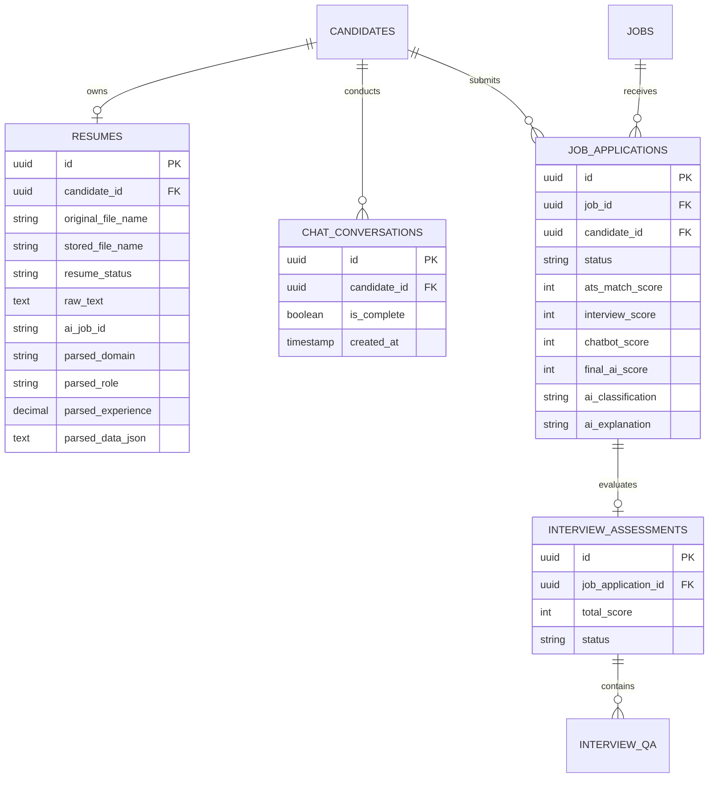

# 🧠 HireAI AI Engine — Architecture, Schema & Backend Integration Specification

**Platform:** Spring Boot 3.5.5 • Java 21 • PostgreSQL 18 • FastAPI • Python 3.11+ • Ollama / Llama 3.1  
**Target Hosts:** Backend `http://localhost:8080` • AI Engine `http://localhost:8000`  
**Document Version:** 1.0 (Integration Blueprint)  
**Date:** August 2026  

---

## 📑 Table of Contents
1. [Executive Summary & System Architecture](#1-executive-summary--system-architecture)
2. [AI Engine (`hireai-ai-engine`) Technical Deep Dive](#2-ai-engine-hireai-ai-engine-technical-deep-dive)
3. [Existing Backend Audit & Gap Analysis](#3-existing-backend-audit--gap-analysis)
4. [Backend Data Models & Entity Schema Changes](#4-backend-data-models--entity-schema-changes)
5. [Complete DTO Class Specifications](#5-complete-dto-class-specifications)
6. [Backend Service Architecture & Client Implementation](#6-backend-service-architecture--client-implementation)
7. [New Spring Boot REST APIs for Frontend Integration](#7-new-spring-boot-rest-apis-for-frontend-integration)
8. [Configuration, Dependencies & Setup](#8-configuration-dependencies--setup)
9. [Step-by-Step Phased Implementation Roadmap](#9-step-by-step-phased-implementation-roadmap)

---

## 1. Executive Summary & System Architecture

HireAI is an enterprise AI-powered recruitment platform. The architecture separates compute-intensive AI operations from transactional database workflows:

```
[ React 19 Frontend ]
         │
         ▼  (HTTP / JSON & Multipart)
[ Spring Boot 3.5.5 Backend (Port 8080) ] ◄──► [ PostgreSQL 18 DB ]
         │
         │  (HTTP / JSON REST Calls)
         ▼
[ FastAPI AI Engine (Port 8000) ]
   ├── Ollama (Llama 3.1:8b) / Gemini / Groq
   └── Sentence Transformers (all-MiniLM-L6-v2)
```

### Core Architectural Rules:
1. **Stateless Compute**: The AI Engine does not connect directly to PostgreSQL. It is a stateless processing engine.
2. **Text Extraction Boundary**: The AI Engine does not handle file uploads. Spring Boot extracts raw text from PDF/DOCX resumes and submits the text payload as JSON.
3. **Synchronous vs Asynchronous Workflows**:
   - **Async (Polling)**: Resume Parsing takes 30–90 seconds on local LLMs. It uses an async job-polling pattern (`POST /api/v1/resumes/parse` -> returns `jobId`, followed by periodic `GET /api/v1/resumes/status/{jobId}`).
   - **Sync**: All other 5 modules (JD Generator, Match Engine, Chatbot, Interview AI, Decision Engine) respond synchronously in real time.
4. **Data Contract**: JSON payloads use `camelCase` for client/server communication while accepting `snake_case` through Pydantic aliases.

---

## 2. AI Engine (`hireai-ai-engine`) Technical Deep Dive

The AI Engine microservice provides 6 functional modules accessible via `/api/v1/`:

### Module 1: Job Description (JD) Generator
- **Endpoint:** `POST /api/v1/jd/generate` (Sync)
- **Purpose:** Generates comprehensive job postings, categorized skills, and initial screening questions from basic role parameters.
- **Request Payload:**
```json
{
  "jobTitle": "Backend Engineer",
  "requiredSkills": ["Java", "Spring Boot", "PostgreSQL", "REST APIs"],
  "experienceLevel": "3-5 years"
}
```
- **Response Payload:**
```json
{
  "description": "Lead the development and maintenance of scalable backend microservices...",
  "responsibilities": [
    "Design and maintain REST APIs for core recruitment platform workflows",
    "Collaborate with product and frontend engineering teams"
  ],
  "mustHaveSkills": ["Java", "Spring Boot", "PostgreSQL", "REST APIs"],
  "niceToHaveSkills": ["Docker", "Kubernetes", "Redis", "Kafka"],
  "interviewQuestions": [
    "Explain how you manage database transactions in Spring Boot.",
    "How do you design a rate-limited API endpoint?"
  ]
}
```

---

### Module 2: Resume Parser (Async Polling)
- **Endpoints:**
  - `POST /api/v1/resumes/parse` (Start Job)
  - `GET /api/v1/resumes/status/{jobId}` (Poll Status)
- **Purpose:** Zero-shot extraction of structured candidate profiles from raw resume text.
- **Start Job Request:**
```json
{
  "candidateId": "cand_1029",
  "resumeText": "Rohan Mehta\nSenior Backend Developer\nSkills: Java, Spring Boot, PostgreSQL, Docker\nExperience: 4 years..."
}
```
- **Start Job Response (`200 OK`):**
```json
{
  "jobId": "3fa85f64-5717-4562-b3fc-2c963f66afa6",
  "status": "processing"
}
```
- **Poll Status Response (`GET /api/v1/resumes/status/{jobId}`):**
```json
{
  "jobId": "3fa85f64-5717-4562-b3fc-2c963f66afa6",
  "status": "complete",
  "result": {
    "candidateId": "cand_1029",
    "skills": ["Java", "Spring Boot", "PostgreSQL", "Docker", "REST"],
    "yearsExperience": 4.0,
    "education": [
      {
        "degree": "B.Tech Computer Science",
        "institution": "Pune Institute of Technology",
        "year": "2020"
      }
    ],
    "projects": [
      {
        "name": "Order Management System",
        "description": "High-throughput microservices application using Spring Cloud"
      }
    ],
    "domain": "fintech",
    "currentRole": "Senior Backend Developer",
    "parseStatus": "success"
  }
}
```

---

### Module 3: Match Engine (Semantic Skill Matching)
- **Endpoint:** `POST /api/v1/match/score` (Sync)
- **Purpose:** Fast semantic vector similarity scoring between candidate skills and job requirements using local `all-MiniLM-L6-v2` embeddings (no external LLM latency).
- **Request Payload:**
```json
{
  "resumeSkills": ["Java", "Spring Boot", "PostgreSQL", "Docker"],
  "jobSkills": ["Java", "Spring Boot", "PostgreSQL", "Kubernetes", "AWS"]
}
```
- **Response Payload:**
```json
{
  "matchScore": 84,
  "matchedSkills": ["Java", "Spring Boot", "PostgreSQL"],
  "missingSkills": ["Kubernetes", "AWS"],
  "autoAction": "shortlist"
}
```
- **Threshold Actions:**
  - `score >= 80`: `"shortlist"`
  - `score < 40`: `"reject"`
  - `40 <= score < 80`: `"review"`

---

### Module 4: AI Pre-Screening Chatbot
- **Endpoint:** `POST /api/v1/chatbot/message` (Sync)
- **Purpose:** Conversational screening assistant that extracts salary expectations, notice period, and availability over multiple interactive turns.
- **Request Payload:**
```json
{
  "candidateId": "cand_1029",
  "conversationHistory": [
    { "role": "bot", "text": "Hi Rohan! What is your current notice period?" },
    { "role": "candidate", "text": "I can join in 30 days." }
  ],
  "newMessage": "My expected CTC is around 18 LPA."
}
```
- **Response Payload:**
```json
{
  "botReply": "Got it. And what is your current CTC at your present company?",
  "extractedFields": {
    "currentCtc": null,
    "expectedCtc": "18 LPA",
    "noticePeriod": "30 days",
    "availability": "30 days"
  },
  "conversationComplete": false
}
```

---

### Module 5: Interview AI
#### Sub-Feature 5A: Question Generation
- **Endpoint:** `POST /api/v1/interview/questions` (Sync)
- **Request Payload:**
```json
{
  "jobId": "job_118",
  "skills": ["Java", "Spring Boot", "PostgreSQL"]
}
```
- **Response Payload:**
```json
{
  "questions": [
    {
      "questionId": "q1",
      "text": "How does Spring Boot handle transaction rollbacks for checked vs unchecked exceptions?",
      "type": "open_text"
    },
    {
      "questionId": "q2",
      "text": "Explain the difference between optimistic and pessimistic locking in PostgreSQL.",
      "type": "open_text"
    },
    {
      "questionId": "q3",
      "text": "Describe how you would troubleshoot a high-memory leak in a Java application.",
      "type": "open_text"
    }
  ]
}
```

#### Sub-Feature 5B: Written Answer Evaluation
- **Endpoint:** `POST /api/v1/interview/evaluate` (Sync)
- **Request Payload:**
```json
{
  "candidateId": "cand_1029",
  "answers": [
    {
      "questionId": "q1",
      "answerText": "By default, @Transactional rolls back on RuntimeException and Error, but not on checked exceptions unless rollbackFor is specified."
    }
  ]
}
```
- **Response Payload:**
```json
{
  "interviewScore": 92,
  "evaluatedAnswers": [
    {
      "questionId": "q1",
      "score": 92,
      "feedback": "Accurate explanation of default rollback rules and rollbackFor attribute."
    }
  ]
}
```

---

### Module 6: Decision Engine
- **Endpoint:** `POST /api/v1/decision/finalize` (Sync)
- **Purpose:** Transparent, auditable mathematical formula combining Resume Score (40%), Interview Score (30%), and Chatbot Signal (30%).
- **Formula:** `finalScore = round(resumeScore * 0.4 + interviewScore * 0.3 + chatbotSignalScore * 0.3)`
- **Request Payload:**
```json
{
  "resumeScore": 88.0,
  "interviewScore": 92.0,
  "chatbotSignalScore": 85.0
}
```
- **Response Payload:**
```json
{
  "finalScore": 88,
  "classification": "shortlist",
  "breakdown": {
    "resumeScore": 88.0,
    "resumeWeight": 0.4,
    "interviewScore": 92.0,
    "interviewWeight": 0.3,
    "chatbotSignalScore": 85.0,
    "chatbotWeight": 0.3
  },
  "explanation": "Strong combined performance across resume, interview, and screening."
}
```
- **Classification Rules:**
  - `finalScore >= 75`: `"shortlist"`
  - `finalScore < 40`: `"reject"`
  - `40 <= finalScore < 75`: `"hold"` (requires manual recruiter review)

---

## 3. Existing Backend Audit & Gap Analysis

| Feature Area | Current Backend State | AI Engine Contract | Action Required |
|---|---|---|---|
| **ATS Scoring** | `LlmAtsClient` calls `/api/v1/ats/score` with `LlmAtsRequest` | Endpoint is `/api/v1/match/score` with `MatchScoreRequest` | **Fix URL and DTO payload** |
| **Resume Upload** | `ResumeUploadRequest` exists; no controller or service logic | Expects plain text via `/api/v1/resumes/parse` | **Add Apache Tika text extractor & upload endpoint** |
| **Resume Parsing Polling** | None | Async polling on `/api/v1/resumes/status/{jobId}` | **Create async scheduler/service for polling** |
| **JD Generator** | Manual JD creation only | `/api/v1/jd/generate` | **Add AI JD generation endpoint & DTOs** |
| **Screening Chatbot** | None | `/api/v1/chatbot/message` (stateless on AI side) | **Add ChatConversation tables & chat endpoint** |
| **Interview AI** | Empty `TestController.java` | `/api/v1/interview/questions` & `/evaluate` | **Add Interview assessment entities & endpoints** |
| **Decision Engine** | None | `/api/v1/decision/finalize` | **Add Decision calculation service & storage** |

---

## 4. Backend Data Models & Entity Schema Changes



---

## 5. Complete DTO Class Specifications

### Group A: Match Engine DTOs
```java
package com.vionsys.hireai.ai.dto.match;

import java.util.List;
import lombok.*;

@Getter @Setter @Builder @NoArgsConstructor @AllArgsConstructor
public class AiMatchScoreRequest {
    private List<String> resumeSkills;
    private List<String> jobSkills;
}

@Getter @Setter @Builder @NoArgsConstructor @AllArgsConstructor
public class AiMatchScoreResponse {
    private int matchScore;
    private List<String> matchedSkills;
    private List<String> missingSkills;
    private String autoAction; // "shortlist" | "review" | "reject"
}
```

### Group B: Resume Parser DTOs
```java
package com.vionsys.hireai.ai.dto.resume;

import java.util.List;
import lombok.*;

@Getter @Setter @Builder @NoArgsConstructor @AllArgsConstructor
public class AiResumeParseRequest {
    private String candidateId;
    private String resumeText;
}

@Getter @Setter @Builder @NoArgsConstructor @AllArgsConstructor
public class AiJobAcceptedResponse {
    private String jobId;
    private String status; // "processing"
}

@Getter @Setter @Builder @NoArgsConstructor @AllArgsConstructor
public class AiJobStatusResponse {
    private String jobId;
    private String status; // "processing" | "complete" | "failed"
    private AiResumeParsedResult result;
}

@Getter @Setter @Builder @NoArgsConstructor @AllArgsConstructor
public class AiResumeParsedResult {
    private String candidateId;
    private List<String> skills;
    private Double yearsExperience;
    private List<EducationDto> education;
    private List<ProjectDto> projects;
    private String domain;
    private String currentRole;
    private String parseStatus;

    @Getter @Setter @NoArgsConstructor @AllArgsConstructor
    public static class EducationDto {
        private String degree;
        private String institution;
        private String year;
    }

    @Getter @Setter @NoArgsConstructor @AllArgsConstructor
    public static class ProjectDto {
        private String name;
        private String description;
    }
}
```

### Group C: JD Generator DTOs
```java
package com.vionsys.hireai.ai.dto.jd;

import java.util.List;
import lombok.*;

@Getter @Setter @Builder @NoArgsConstructor @AllArgsConstructor
public class AiJdGenerateRequest {
    private String jobTitle;
    private List<String> requiredSkills;
    private String experienceLevel;
}

@Getter @Setter @Builder @NoArgsConstructor @AllArgsConstructor
public class AiJdGenerateResponse {
    private String description;
    private List<String> responsibilities;
    private List<String> mustHaveSkills;
    private List<String> niceToHaveSkills;
    private List<String> interviewQuestions;
}
```

### Group D: Chatbot DTOs
```java
package com.vionsys.hireai.ai.dto.chatbot;

import java.util.List;
import lombok.*;

@Getter @Setter @Builder @NoArgsConstructor @AllArgsConstructor
public class AiChatMessageRequest {
    private String candidateId;
    private List<AiChatTurn> conversationHistory;
    private String newMessage;
}

@Getter @Setter @Builder @NoArgsConstructor @AllArgsConstructor
public class AiChatTurn {
    private String role; // "bot" | "candidate"
    private String text;
}

@Getter @Setter @Builder @NoArgsConstructor @AllArgsConstructor
public class AiChatMessageResponse {
    private String botReply;
    private AiExtractedFields extractedFields;
    private boolean conversationComplete;
}

@Getter @Setter @Builder @NoArgsConstructor @AllArgsConstructor
public class AiExtractedFields {
    private String currentCtc;
    private String expectedCtc;
    private String noticePeriod;
    private String availability;
}
```

### Group E: Interview AI & Decision DTOs
```java
package com.vionsys.hireai.ai.dto.interview;

import java.util.List;
import lombok.*;

@Getter @Setter @Builder @NoArgsConstructor @AllArgsConstructor
public class AiInterviewQuestionsRequest {
    private String jobId;
    private List<String> skills;
}

@Getter @Setter @Builder @NoArgsConstructor @AllArgsConstructor
public class AiInterviewQuestionsResponse {
    private List<QuestionItem> questions;

    @Getter @Setter @NoArgsConstructor @AllArgsConstructor
    public static class QuestionItem {
        private String questionId;
        private String text;
        private String type;
    }
}

@Getter @Setter @Builder @NoArgsConstructor @AllArgsConstructor
public class AiInterviewEvaluateRequest {
    private String candidateId;
    private List<AnswerItem> answers;

    @Getter @Setter @NoArgsConstructor @AllArgsConstructor
    public static class AnswerItem {
        private String questionId;
        private String answerText;
    }
}

@Getter @Setter @Builder @NoArgsConstructor @AllArgsConstructor
public class AiInterviewEvaluateResponse {
    private int interviewScore;
    private List<EvaluatedAnswerItem> evaluatedAnswers;

    @Getter @Setter @NoArgsConstructor @AllArgsConstructor
    public static class EvaluatedAnswerItem {
        private String questionId;
        private int score;
        private String feedback;
    }
}
```

```java
package com.vionsys.hireai.ai.dto.decision;

import lombok.*;

@Getter @Setter @Builder @NoArgsConstructor @AllArgsConstructor
public class AiDecisionRequest {
    private Double resumeScore;
    private Double interviewScore;
    private Double chatbotSignalScore;
}

@Getter @Setter @Builder @NoArgsConstructor @AllArgsConstructor
public class AiDecisionResponse {
    private int finalScore;
    private String classification; // "shortlist" | "hold" | "reject"
    private Object breakdown;
    private String explanation;
}
```

---

## 6. Backend Service Architecture & Client Implementation

### Unified `AiEngineClient.java`
```java
package com.vionsys.hireai.ai.client;

import java.time.Duration;
import org.springframework.beans.factory.annotation.Value;
import org.springframework.http.MediaType;
import org.springframework.http.client.SimpleClientHttpRequestFactory;
import org.springframework.stereotype.Component;
import org.springframework.web.client.RestClient;

import com.vionsys.hireai.ai.dto.match.*;
import com.vionsys.hireai.ai.dto.resume.*;
import com.vionsys.hireai.ai.dto.jd.*;
import com.vionsys.hireai.ai.dto.chatbot.*;
import com.vionsys.hireai.ai.dto.interview.*;
import com.vionsys.hireai.ai.dto.decision.*;

@Component
public class AiEngineClient {

    private final RestClient restClient;

    public AiEngineClient(
            @Value("${ai-engine.base-url:http://localhost:8000}") String baseUrl,
            @Value("${ai-engine.timeout-ms:30000}") int timeoutMs) {

        SimpleClientHttpRequestFactory factory = new SimpleClientHttpRequestFactory();
        factory.setConnectTimeout(Duration.ofMillis(timeoutMs));
        factory.setReadTimeout(Duration.ofMillis(timeoutMs));

        this.restClient = RestClient.builder()
                .baseUrl(baseUrl)
                .requestFactory(factory)
                .build();
    }

    public AiJdGenerateResponse generateJd(AiJdGenerateRequest request) {
        return restClient.post().uri("/api/v1/jd/generate")
                .contentType(MediaType.APPLICATION_JSON).body(request)
                .retrieve().body(AiJdGenerateResponse.class);
    }

    public AiJobAcceptedResponse submitResumeForParsing(AiResumeParseRequest request) {
        return restClient.post().uri("/api/v1/resumes/parse")
                .contentType(MediaType.APPLICATION_JSON).body(request)
                .retrieve().body(AiJobAcceptedResponse.class);
    }

    public AiJobStatusResponse checkResumeParseStatus(String jobId) {
        return restClient.get().uri("/api/v1/resumes/status/{jobId}", jobId)
                .retrieve().body(AiJobStatusResponse.class);
    }

    public AiMatchScoreResponse calculateMatchScore(AiMatchScoreRequest request) {
        return restClient.post().uri("/api/v1/match/score")
                .contentType(MediaType.APPLICATION_JSON).body(request)
                .retrieve().body(AiMatchScoreResponse.class);
    }

    public AiChatMessageResponse sendChatMessage(AiChatMessageRequest request) {
        return restClient.post().uri("/api/v1/chatbot/message")
                .contentType(MediaType.APPLICATION_JSON).body(request)
                .retrieve().body(AiChatMessageResponse.class);
    }

    public AiInterviewQuestionsResponse generateInterviewQuestions(AiInterviewQuestionsRequest request) {
        return restClient.post().uri("/api/v1/interview/questions")
                .contentType(MediaType.APPLICATION_JSON).body(request)
                .retrieve().body(AiInterviewQuestionsResponse.class);
    }

    public AiInterviewEvaluateResponse evaluateInterview(AiInterviewEvaluateRequest request) {
        return restClient.post().uri("/api/v1/interview/evaluate")
                .contentType(MediaType.APPLICATION_JSON).body(request)
                .retrieve().body(AiInterviewEvaluateResponse.class);
    }

    public AiDecisionResponse finalizeDecision(AiDecisionRequest request) {
        return restClient.post().uri("/api/v1/decision/finalize")
                .contentType(MediaType.APPLICATION_JSON).body(request)
                .retrieve().body(AiDecisionResponse.class);
    }
}
```

---

## 7. New Spring Boot REST APIs for Frontend Integration

### Recruiter APIs
| Method | Path | Auth | Description |
|---|---|---|---|
| `POST` | `/api/v1/recruiter/ai/jd/generate` | `ROLE_RECRUITER` | AI-assisted job description generator |
| `POST` | `/api/v1/recruiter/ai/match/{jobId}/{candidateId}` | `ROLE_RECRUITER` | On-demand candidate ATS match calculation |
| `POST` | `/api/v1/recruiter/ai/applications/{id}/decision` | `ROLE_RECRUITER` | Triggers Decision Engine calculation |

### Candidate APIs
| Method | Path | Auth | Description |
|---|---|---|---|
| `POST` | `/api/v1/candidate/resume/upload` | `ROLE_CANDIDATE` | Uploads PDF/DOCX resume file & starts parse job |
| `GET` | `/api/v1/candidate/resume/status` | `ROLE_CANDIDATE` | Gets current resume parsing status |
| `POST` | `/api/v1/candidate/chat/message` | `ROLE_CANDIDATE` | Sends message to AI screening chatbot |
| `GET` | `/api/v1/candidate/chat/history` | `ROLE_CANDIDATE` | Retrieves chatbot conversation turns |
| `GET` | `/api/v1/candidate/applications/{id}/interview` | `ROLE_CANDIDATE` | Fetches screening interview questions |
| `POST` | `/api/v1/candidate/applications/{id}/interview/submit` | `ROLE_CANDIDATE` | Submits answers for AI grading |

---

## 8. Configuration, Dependencies & Setup

### Maven `pom.xml` Addition
```xml
<!-- Apache Tika for PDF/DOCX Resume Extraction -->
<dependency>
    <groupId>org.apache.tika</groupId>
    <artifactId>tika-core</artifactId>
    <version>2.9.2</version>
</dependency>
<dependency>
    <groupId>org.apache.tika</groupId>
    <artifactId>tika-parsers-standard-package</artifactId>
    <version>2.9.2</version>
</dependency>
```

### `application.properties` Updates
```properties
# AI Engine Microservice
ai-engine.base-url=http://localhost:8000
ai-engine.timeout-ms=30000
ai-engine.polling-interval-ms=4000
ai-engine.polling-max-attempts=30

# File Upload Settings
spring.servlet.multipart.max-file-size=10MB
spring.servlet.multipart.max-request-size=10MB
```

---

## 9. Step-by-Step Phased Implementation Roadmap

```
┌─────────────────────────────────────────────────────────────┐
│ Phase 1: Core Client & Match Engine Fix                     │
│ • Fix LlmAtsClient -> /api/v1/match/score                   │
│ • Build AiEngineClient & Configuration                      │
└──────────────────────────────┬──────────────────────────────┘
                               │
┌──────────────────────────────▼──────────────────────────────┐
│ Phase 2: Resume Parser & File Text Extractor                │
│ • Add Apache Tika to pom.xml                                │
│ • Build file upload endpoint & text extractor               │
│ • Implement async polling worker for resume parsing         │
└──────────────────────────────┬──────────────────────────────┘
                               │
┌──────────────────────────────▼──────────────────────────────┐
│ Phase 3: AI Job Description Generator                      │
│ • Add AiJdGenerate DTOs & Recruiter endpoint                │
│ • Hook into recruiter job creation modal                    │
└──────────────────────────────┬──────────────────────────────┘
                               │
┌──────────────────────────────▼──────────────────────────────┐
│ Phase 4: Conversational Screening Chatbot                   │
│ • Create ChatConversation & ChatMessage entities            │
│ • Implement chat turn orchestrator & candidate auto-update  │
└──────────────────────────────┬──────────────────────────────┘
                               │
┌──────────────────────────────▼──────────────────────────────┐
│ Phase 5: Interview AI & Automated Decision Engine           │
│ • Create InterviewAssessment entities                       │
│ • Implement question generation & answer grading            │
│ • Connect Decision Engine to application workflow           │
└─────────────────────────────────────────────────────────────┘
```

---
*Generated by HireAI Engineering Team — Confidential & Proprietary.*
